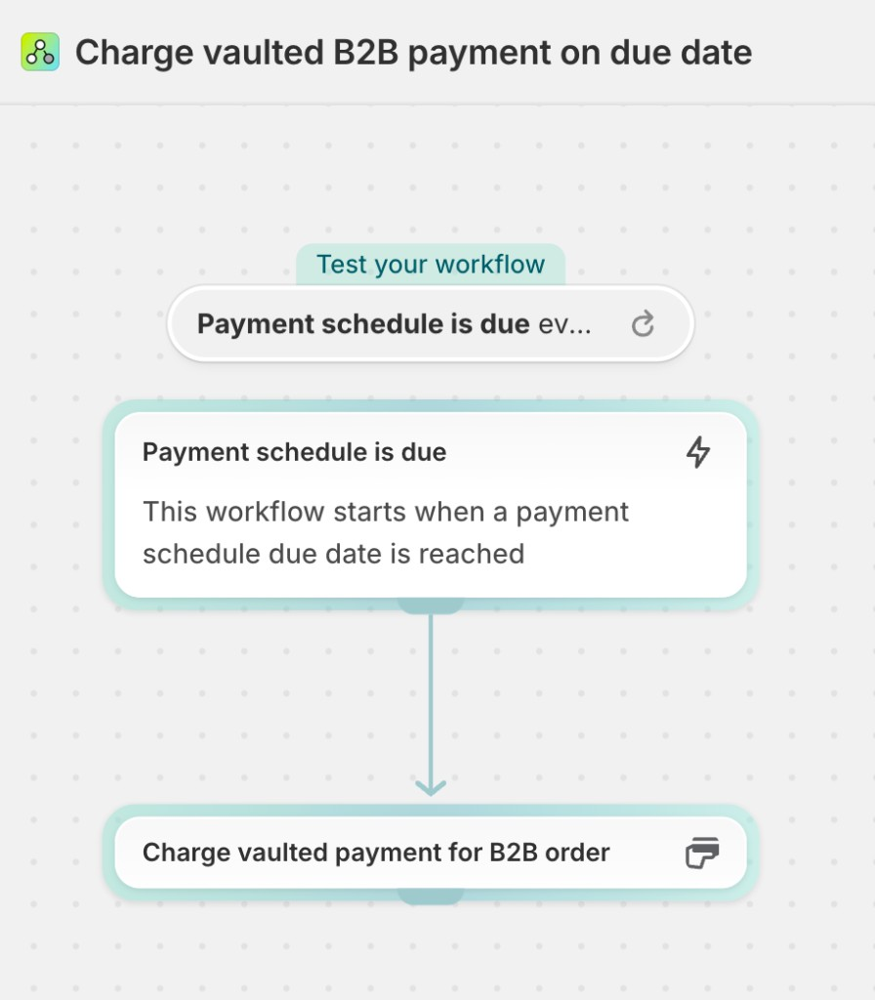
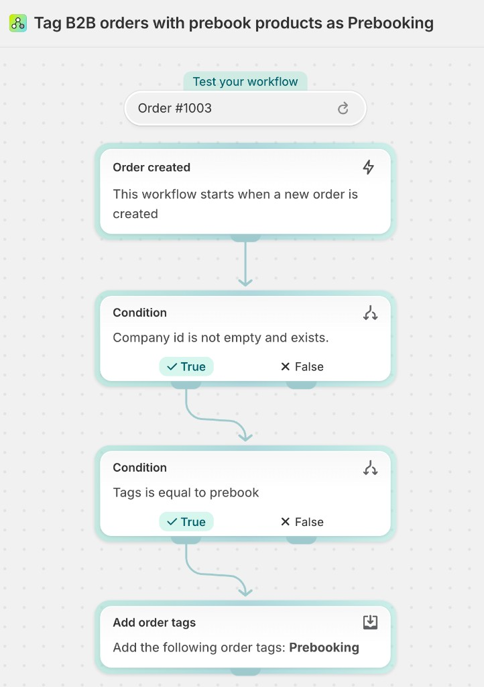

# Follow along

Your single doc for building B2B pre-booking in this session. Keep it open and work top to bottom.
Copy the prompts straight from the fenced blocks; you don't need to open any other file in the repo.

> **This is an AI-assisted ("vibe coding") build, not hands-on coding.** You paste the prompts below into
> your AI assistant and it writes the code; you don't hand-write or debug it. Read what it produces; if a
> step misbehaves, use the recovery steps at the end (you drop in the finished version, you never debug).

Your prework (store seed, Shopify Payments in test mode, Shopify Flow installed) is already done, per
[`PREWORK.md`](PREWORK.md). Background and the "why": the [`README`](README.md).

Test every checkpoint while **logged into the storefront as your B2B buyer (Maya Cruz)** on the
**Combined** location. The admin preview and normal (DTC) visitors won't trigger the block or the B2B
payment behavior, so always check as the buyer.

> **Stuck on a build?** Jump to [Quick recovery](#quick-recovery). One command drops in the finished
> file and `dev` reloads: `git checkout origin/finished -- <path>` (run from `starter/b2b-prebooking-workshop`).

---

## What you'll see (the finished flow)

The demo at the start is the destination. As **Maya Cruz** on a supplier's B2B store:

- Add an **available-now** item: no pre-book panel on the page, and at checkout it's **Net 30** with
  "pay later" available (**catalogs**, **payment terms**).
- Add a **pre-book** item: the product page shows the ordering and delivery windows, and the cart line
  carries `Season` + `Delivery window` (**custom data**, **theme / Liquid**).
- Go to checkout on the mixed cart: terms flip to **due on fulfillment**, "pay later" is gone, and a card
  is required (**payment customizations**, **vaulted cards & ACH**).
- Place the order, then fulfill a line: the vaulted card is **charged automatically** for that shipment,
  and again when the pre-book line ships (**Shopify Flow**). Maya sees the updates in her account.

You'll build the core of that now: the theme block, the payment Function, and the charge Flow.

---

## A setup that works (use whatever you like)

You'll have two things going at once: a **terminal** running `shopify app dev --use-localhost` (leave it
up all session; press **`g`** in it to open GraphiQL), and your **AI assistant** where you paste the
build prompts. Lay them out however works for you (two terminal tabs, split panes, separate windows).
Turn on **auto-accept edits** in your assistant so it doesn't stop for approval on every file. You don't
run `shopify app deploy` during the build; `dev` rebuilds on save.

---

## Part 0: Set up the app

A one-time setup that registers your app **with** the payment-customizations permission *before* you
install it, so activation in Part 2 works the first time. **Run these one at a time**, top to bottom;
each is its own step (a couple are interactive, so don't paste them as a batch).

Move into the app folder:

```bash
cd starter/b2b-prebooking-workshop
```

Install dependencies:

```bash
pnpm install
```

Create your app. When prompted, pick your Partner org, choose **create it as a new app**, name it, and **release** the version:

```bash
shopify app deploy
```

Set the payment-customizations scope your app needs, then redeploy (**release** again when prompted). This is what makes Part 2 activation work the first time:

```bash
pnpm run set-scopes
```

Start the dev session. Pick your store and **approve the install in your browser** (the consent screen now lists payment customizations). Leave this running all session; press **`g`** here to open GraphiQL:

```bash
shopify app dev --use-localhost
```

<sub>Using npm? `npm install`, `npm run set-scopes`; the `shopify …` commands are the same either way.</sub>

On the first `shopify app dev --use-localhost` run you may also be asked for your **storefront password** (Admin → Online Store → Preferences) and, for `--use-localhost`, a mkcert prompt: choose **"Yes, use mkcert to generate it"** and enter your Mac/sudo password (one-time per machine).

`--use-localhost` serves the dev session over a local HTTPS proxy instead of a Cloudflare tunnel, which avoids room-wide throttling when everyone starts at once.

---

## Part 1: Theme block

We'll build the **theme block** first, the pre-book panel on the product page. It reads the **custom
data** (the season) attached to a product, shows the ordering + delivery windows to the buyer, and
attaches those values to the cart line so they carry through to checkout (works on any plan).

### Start the build

Make sure **auto-accept edits** is on, then paste the **entire** block into your AI assistant:

```text
In this theme app extension, create an app block `blocks/b2b-prebooking.liquid`
with a `product` setting (autofill true).

You only need to edit files (dev is running and hot-reloads); do not run any CLI commands.
Do NOT run sleep/polling loops, inspect running processes, or wait for codegen; if a change
doesn't appear, note it in one line and move on, do not investigate the environment.
The metaobject field keys below are correct, use them as-is; do not search the repo to confirm
the data model (it's seeded on the store, not in this repo).

Read the product's metaobject reference into a `season` variable from the `custom` namespace:
`product.metafields["custom"]["b2b-prebooking"].value`.

Render only when the season is present AND the buyer is a B2B buyer (`customer.b2b?`),
plus also render in the theme editor (`request.design_mode`) so the block can be positioned.

When shown, display:
- a "Pre-book: {season_name}" badge
- the ordering window (order_start_date to order_end_date)
- the expected delivery window (delivery_start_date to delivery_end_date), formatted as dates
- a short note that the item is placed now and ships in the delivery window with payment due on fulfillment

Use literal English strings for all copy; do NOT use the `| t` translation filter or add a locales
file (theme-check reports false-positive `TranslationKeyExists` errors for app-extension locales,
which is confusing on stage, and this isn't a localization exercise).

Put all CSS in a single inline `<style>` block inside the Liquid file. Do NOT use a separate
`assets/` CSS file or `asset_url` (theme app blocks cannot use the `` tag either);
an inline `<style>` is Shopify's recommended way to ship instance-specific block CSS and, unlike an
external asset, it can't be knocked out by dev-preview asset-URL rotation when a sibling extension
rebuilds. Use neutral colors that read on a light storefront theme, and do NOT add an OS
`prefers-color-scheme` dark-mode media query (the storefront theme controls the palette, not the
visitor's OS).

Add a script that attaches `properties[Season]` and `properties[Delivery window]` to the cart line
so they become visible line item properties. Bake the values into the script from Liquid (`| json`);
do not read metafields client-side.

This is a `target: "section"` block that renders OUTSIDE the product form, and the default Horizon
theme builds the `/cart/add` request from selected fields rather than serializing the whole form,
so do BOTH of these:

(1) inject hidden inputs into the add-to-cart form found at the document level
    (`document.querySelectorAll('form[action*="/cart/add"]')`, not the block's own element),
    idempotently, re-injecting on variant change (`change` on `input[name="id"]`) and section
    re-render (`MutationObserver`);

AND

(2) intercept the `/cart/add` request by patching `window.fetch` and `XMLHttpRequest.prototype.send`,
    and append the `properties[...]` entries ONLY when the request body is a `FormData` whose
    `product-id` equals `block.settings.product.id` (skip when `product-id` is absent or differs,
    so a same-page quick-add of a DIFFERENT product, e.g. "you may also like", is not mis-tagged
    with this product's season).

Part (2) is what makes it work on Horizon; part (1) covers classic themes.
```

### While it builds: teach, and author the season in Admin

The block takes a couple of minutes to generate. Two things to do meanwhile.

**Say what the block does (three ideas, no need to open files):**

1. **It runs conditionally:** only for a B2B buyer on a product that has a season (plus the theme editor). Everything else renders nothing.
2. **It renders the custom-data values:** it reads the season from `product.metafields["custom"]["b2b-prebooking"]`, one line, nothing hardcoded, so it updates automatically when the season changes.
3. **It adds line item attributes:** it writes `properties[Season]` and `properties[Delivery window]` onto the cart line, so pre-book context reaches checkout on any plan (no Plus required).

**Author the season (Admin), the custom data the block reads.** The **definitions** already exist on your
store (seeded in prework, store-owned); you're adding the **values**:

1. **See the definitions.** Settings → Custom data → Metaobjects → **B2B Pre-booking**, and Metafields → Products → **B2B Pre-booking** (`custom.b2b-prebooking`).
2. **Create the season.** Settings → Custom data → Metaobjects → **B2B Pre-booking** → **Add entry**, fill in and **Save**:

| Field | Value |
|---|---|
| Season name | `Spring/Summer 2027` |
| Order start date | `2026-07-01` |
| Order end date | `2026-09-30` |
| Delivery start date | `2027-01-15` |
| Delivery end date | `2027-02-28` |

3. **Assign it to the five pre-book products.** Products → select the five titles ending in `(Pre-book)` → **Edit products** (bulk editor) → **Columns → Metafields → B2B Pre-booking** → click the first product's cell, **Shift-click** the last, pick **Spring/Summer 2027** once (it applies to all) → **Save**.

<sub>Prefer code? Because the data model is store-owned, you can also upsert the season and set the references via the app's GraphiQL (press `g`) or `shopify store execute`. Admin is faster for one season.</sub>

### Place the block

With `dev` still running, open a **pre-book product** in the theme editor → **Add block → Apps → B2B Pre-booking** → save. No deploy needed.

### Verify (as Maya Cruz on the storefront)

- **Available-now product:** no panel; add to cart → no `Season`/`Delivery window` on the line; at checkout it's **Net 30** with "pay later" available.
- **Pre-book product:** the windows panel renders; add to cart → `Season` + `Delivery window` appear on the cart line and at checkout.
- At checkout the pre-book cart **still shows Net 30 and the "pay later" option**, that's what Part 2 fixes.

**If it looks off:** washed-out on the storefront but fine in the theme editor usually means a dark-mode CSS media query slipped in, remove it. If the block renders but nothing appears on the cart line, the `/cart/add` intercept (part 2 of the prompt) is missing; check DevTools → Network → the `/cart/add` request should include `properties[Season]`.

---

## Part 2: Payment customization Function

On the Combined location, a mixed cart should switch to **due on fulfillment** and hide "pay later" so a
card gets vaulted. That's the **payment customization** building block, a Shopify Function in your app.

### Start the build

```text
Implement the `cart.payment-methods.transform.run` target.

Follow these constraints so the build stays fast:
- Edit only the files in `src/` (the `.ts` and its `.graphql` input query). dev is running and rebuilds on save.
- Do NOT run any CLI commands. Do NOT wait for or inspect `generated/api.ts` (type codegen is a separate step that does not hot-reload; write against the query below). If generated types look stale, ignore it and proceed.
- Do NOT run sleep/polling loops or inspect running processes. If the environment looks off, note it in one line and move on; do not investigate.
- Type the input and output LOCALLY in the .ts to mirror the query below; do NOT import from `../generated/api` (tsconfig `rootDir` is `./src`, so that import breaks the typecheck).
- Trust the Shopify validator for the final check; do NOT read `schema.graphql`.

Use exactly this input query (purchasingCompany is under cart.buyerIdentity, not cart):

query {
  cart {
    buyerIdentity {
      purchasingCompany { company { id } }
    }
    lines {
      merchandise {
        __typename
        ... on ProductVariant {
          product {
            metafield(namespace: "custom", key: "b2b-prebooking") { value }
          }
        }
      }
    }
  }
  paymentMethods { id name }
}

Logic:
- If cart.buyerIdentity.purchasingCompany is null, return no operations.
- If any line's product has the `custom.b2b-prebooking` metafield set, it's a pre-book cart:
  - return a `paymentTermsSet` operation with an event trigger of `FULFILLMENT_CREATED` (due on fulfillment)
  - plus `paymentMethodHide` for any payment method whose name matches the deferred option
- Otherwise return no operations.

Match the deferred method by name. On B2B checkout the underlying name is "Deferred"
(the label shown to buyers is "Choose payment method at a later time"). Keep the match configurable.
```

### While it builds: teach, and cover Plus vs non-Plus

**Say what the Function does (three ideas):**

1. **It runs conditionally (fails open):** no changes unless the cart is B2B **and** contains a pre-book item. Every other checkout passes through untouched.
2. **It hides the deferred option:** it hides the method named `"Deferred"` (the real input name, not the buyer-facing "Choose payment method at a later time"), so a card gets vaulted.
3. **It changes the payment terms for this order:** it sets **due on fulfillment** (`paymentTermsSet`) for just this checkout.

**Plus vs non-Plus (use the build time to explain the boundary).** Changing payment terms at checkout
(`paymentTermsSet`) is **Plus-only**. That's why the non-Plus arrangement uses **two separate company
locations**, one Available Now (Net 30) and one Pre-book (due on fulfillment), so each carries its own
fixed terms instead of switching them mid-checkout. Hiding the deferred method is available to non-Plus
too, but through a **public App Store app** rather than a custom Function (custom Functions are Plus-only).

### It won't change checkout yet, activate it

When the build finishes, check out again as Maya, nothing changes. Implementing the Function isn't
enough; it doesn't run at checkout until you create a **payment customization** that points at it. Do
that with one mutation in the app's GraphiQL: in the `dev` terminal press **`g`**, set the API version to
the latest stable, and run:

```graphql
mutation {
  paymentCustomizationCreate(paymentCustomization: {
    title: "B2B Prebooking Payment Terms"
    enabled: true
    functionHandle: "prebooking-payment-terms"
  }) {
    paymentCustomization { id title enabled }
    userErrors { field message }
  }
}
```

You should get back an `id` with empty `userErrors`. This mutation is the same for everyone (the
`functionHandle` is fixed in the starter).

### Verify (as Maya Cruz on Combined)

Refresh checkout:

| Cart | Terms | "Pay later" |
|---|---|---|
| Mixed (available-now + pre-book) | Due on fulfillment | Hidden |
| Available-now only | Net 30 | Visible |

Because of the conditional logic, an available-now-only order is untouched. The terminal prints a line
each time the Function runs. Don't place the order yet, you'll run one clean test order after the Flows
are built.

---

## Part 3: Flows

Now make the merchant's life easier with **Shopify Flow**: when a pre-book order is fulfilled, charge the
vaulted card **automatically** (which is why the Function forced a card on file). Build these **before**
you place a test order, so the automation is live when you fulfill. Build in **Admin → Shopify Flow** with
Sidekick. **3a (charge on fulfillment) is required, build it first.** **3b (tag) is optional.**

### 3a. Charge on fulfillment (required)

```text
Create a new Flow to automatically charge a saved B2B payment method when a payment schedule
becomes due.

When a payment schedule due date is reached, capture the vaulted payment method associated with
that payment schedule.
```

The trigger fires when a payment schedule comes due (for due-on-fulfillment, that's when you fulfill),
and the action charges the vaulted method for that schedule. No condition is needed: the **charge action
already skips schedules that have been paid**, so it won't double-charge. It acts on the **payment
schedule, not any tag**, so it stands on its own. Same Flow on both plans: non-Plus charges once at full
fulfillment, Plus charges per fulfillment.

**Or build it by hand (fastest, no Sidekick):** in Shopify Flow, **Create workflow** → trigger **Payment
schedule is due** → action **Charge vaulted payment for B2B order** → **turn it on**. Two steps, no
condition.

**Prefer to import it?** Use the ready-made workflow:
[`workshop-assets/flow/charge-on-fulfillment.flow`](workshop-assets/flow/charge-on-fulfillment.flow)
(Shopify Flow → **Import**). Preview it, save it, and **turn it on**. Built, it looks like this:

<a href="workshop-assets/flow/images/charge-on-fulfillment-flow.png"></a>

<sub>Click to enlarge.</sub>

However you built it (Sidekick or import), preview, save, and **turn the workflow on**. You'll watch it
fire when you fulfill the test order below.

### 3b. Tag pre-book orders (optional)

```text
Create a new Flow to tag orders with the tag "Prebooking"
if the order is a B2B order
and the order has a product tagged "prebook".
```

The B2B condition keeps normal (DTC) orders untagged. The product tag `prebook` identifies a pre-book
line; the order tag **`Prebooking`** lets the store owner filter their Orders list to just the pre-book
orders. Purely for visibility, the charge Flow above doesn't depend on it, so skip it if you're short on
time.

**Prefer not to build it live?** Import the ready-made workflow instead:
[`workshop-assets/flow/tag-prebook-orders.flow`](workshop-assets/flow/tag-prebook-orders.flow)
(Shopify Flow → **Import**). Built, it looks like this:

<a href="workshop-assets/flow/images/tag-prebook-orders-flow.png"></a>

<sub>Click to enlarge.</sub>

**Checkpoint:** a new B2B pre-book order gets the `Prebooking` tag; a DTC order with the same product does not. The tag is async (a couple of minutes) and nothing waits on it.

---

## Part 4: Test the full order (as Maya Cruz)

Everything is built. Run one clean end-to-end test order to see all three pieces work together, as the
**B2B buyer, Maya Cruz**, on the **Combined** location.

1. **Log in** to the storefront as Maya Cruz (one-time emailed code).
2. Open a **pre-book** product page and confirm the **theme block** appears (the ordering and delivery windows).
3. **Add it to the cart** (add an available-now item too, so it's a mixed order) and confirm the **line item attributes** (`Season`, `Delivery window`) appear in the cart and at checkout.
4. At **checkout**, confirm the payment terms are now **due on fulfillment** and **"choose payment method at a later time" is hidden**.
5. **Place the order** (if you didn't save a card, you're prompted to vault one, the order carries terms).
6. In **Admin → Orders**, open the order you just placed.
7. **Fulfill the available-now item(s).** Its payment schedule becomes due, and the charge Flow **charges the vaulted card automatically** for that fulfillment.
8. On the **storefront as Maya**, view the order and confirm the **partial charge**.
9. Back in **Admin**, **fulfill the pre-book item(s).** That schedule becomes due and the vaulted card is **charged automatically** again.
10. On the **storefront as Maya** again, confirm the **full amount** has now been charged.

**Checkpoint:** two hands-off charges, one per fulfillment, and nobody ever touched the card. (If you built the optional tag Flow, the order is also tagged `Prebooking` once the async tag lands.)

---

## Recap: non-Plus and take-home

You built a B2B pre-order flow: a product-page block that carries season context to checkout (custom
data + Liquid), a payment customization Function that sets the right terms and forces a vaulted card, and
a Flow that charges that card automatically on fulfillment.

**Non-Plus.** A non-Plus merchant (Basic, Grow, Advanced) can't change payment terms at checkout
(`paymentTermsSet`) or charge per fulfillment. That's why your seeded store also has **Available Now** and
**Pre-book** locations: each carries its own fixed terms, so you pre-separate the journeys instead of
switching terms on one order. The theme block and the charge Flow work unchanged; force-vaulting comes
from a public App Store app instead of the custom Function. **Take-home: rebuild this on an Advanced dev
store using those two locations to see the difference.**

The [`b2b-preorder-reference-sheet.md`](b2b-preorder-reference-sheet.md) maps six common pre-order
patterns to the platform building blocks on Plus and non-Plus. This is just one example; we hear lots of
different use cases from merchants, so go build.

---

## Quick recovery

**Golden rule:** if a step's code is broken and the fix isn't obvious in a minute, drop in the finished
version and keep moving. The `finished` branch has every file completed, so from
`starter/b2b-prebooking-workshop` you can run `git checkout origin/finished -- <path>` and `dev` hot-reloads it.
Prefer to paste rather than prompt? [`CODE.md`](CODE.md) has the finished theme block and Function as
copy-paste (or paste-to-your-AI) blocks.

**Watch the clock.** The theme block usually generates in ~3 min and the Function in ~2-3 min. If a build
runs well past that, or the AI starts investigating the environment (sleep/polling loops, process checks,
waiting on `generated/api.ts`), stop it and drop in the finished file rather than let it rabbit-hole:

```bash
# theme block
git checkout origin/finished -- extensions/prebooking-theme/blocks/b2b-prebooking.liquid
# payment Function
git checkout origin/finished -- extensions/prebooking-payment-terms/src/*
# everything (both extensions, if you're not sure which broke)
git checkout origin/finished -- extensions
```

| Problem | Fix |
|---|---|
| `dev` stopped (`AbortError`), or the block suddenly renders **unstyled** (CSS 404), often right after a build step | Work down this ladder: **1)** restart `shopify app dev --use-localhost` + hard-refresh the storefront; **2)** if the preview is stuck (`app-preview` errors, edits not landing): `shopify app dev clean` then `shopify app dev --use-localhost`; **3)** if it says **"CLI credentials are invalid"**: `shopify auth logout` → `shopify auth login`, then `shopify app dev --use-localhost`. |
| **Theme block** is broken / won't style / no properties on the cart, and you're stuck | `git checkout origin/finished -- extensions/prebooking-theme/blocks/b2b-prebooking.liquid`, save; re-add the block in the theme editor if needed. |
| **Payment Function** behaves wrong, and you're stuck | `git checkout origin/finished -- extensions/prebooking-payment-terms/src/*`, then re-activate via press-`g`. |
| Red `TranslationKeyExists` lines in the terminal | Ignore them (theme-check false positive); the prompt uses literal strings to avoid this. |
| GraphiQL says "Could not find Function" | `dev` must be running; press `g` again. |
| Activation says `ACCESS_DENIED` / needs `write_payment_customizations` | Run `pnpm run set-scopes` in `starter/b2b-prebooking-workshop`, re-approve the install in the browser, then re-run the mutation. |
| **Flow** built wrong by Sidekick | Import the ready-made `.flow` files from [`workshop-assets/flow/`](workshop-assets/flow/) instead. |

### Start a part over

Reset only touches what you built in the session, not the pre-seeded store structure:

- **Payment customization (Part 2):** no Admin UI, so in the app's GraphiQL (press `g`) run `query { paymentCustomizations(first: 20) { nodes { id title enabled } } }`, then `paymentCustomizationDelete(id: "…")`; re-activate with `paymentCustomizationCreate`.
- **Season values (Part 1):** clear the **B2B Pre-booking** column in the bulk editor, then delete the season entry (Settings → Custom data → Metaobjects). The definition stays (store-owned).
- **Theme block (Part 1):** Online Store → Themes → Customize → select the **B2B Pre-booking** block → Remove block.
- **Flows (Part 3):** open Shopify Flow, turn off or delete the workflow(s).
- **Test orders:** Cancel (voids the authorization), then Archive.

---

## More detail

The same prompts with longer explanations live in [`prompts/`](prompts/).
